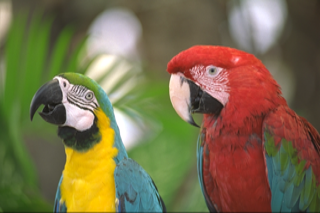
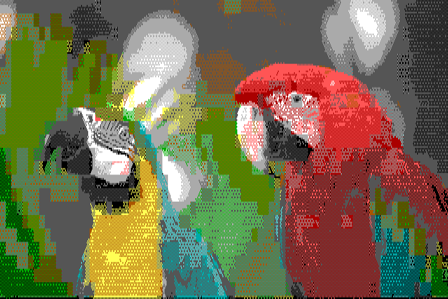
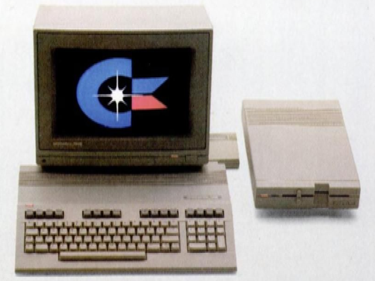
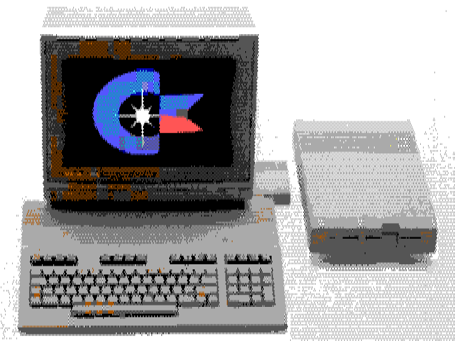
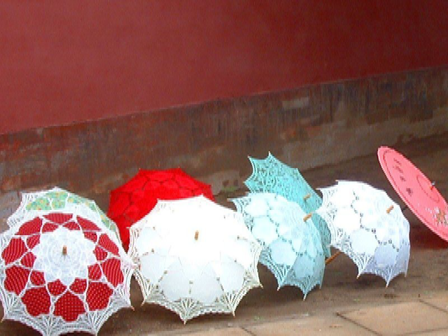
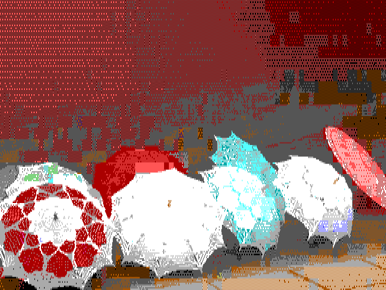

## What it Does

Dithersaurus is a tool for dithering images to meet the constraints of retro
hardware. Modern hardware can typically display any 24-bit RGB value at any
pixel, but most retro hardware not only has a limited palette (eg: 16 colors to
work with), but also restrictions on where colors may be used.

Dithersaurus is very much a work in progress. Right now it only supports one
palette and one type of constraint: the Commodore 128 VDC palette with a 2
colors per 8×8 pixel cell.

Here are some example of what it does:

| Before | After |
| ------ | ----- |
|  |  |
|  |  |
|  |  |

Note that these examples have been re-scaled after the fact replicate the
"retro" aspect ratio. (See [Previewing](#Previewing) section, below.) 

## Installing

For now, you need to use pip3 to install some dependencies:

    pip3 install --user numpy pillow colour-science
    pip3 install --user git+https://www.github.com/hbldh/hitherdither

## How to Use It

### Scaling

Images should first be scaled to the correct size and aspect ratio. For now, an
external tool is needed to do this. ImageMagick works well.

You can use the formula to find the pixel aspect ratio:

    pixel_width * aspect_width / (pixel_height * aspect_height)

For the 640×200 VDC display, which has a 4:3 aspect ratio, this gives us:

    640 * 3 / (200 * 4)

or 240%. We need to first scale by the recipriocal, which is 41.666%.

You also generally want to resize the image to fit on the display.
To do both of the above with ImageMagick:

    convert -scale '100%x41.666%' -resize '640x200' input.png scaled.png

The `--resize` flag is optional, but will scale the image to fit in the
desired rectangle, 640×200 in this case, while preserving aspect ratio.

### Dithering

Once your image has been appropriately scaled, you can give it to dithersaurus:

    ./dithersaurus.py scaled.png dithered.png

Note that this step is extremely slow!

### Previewing

To preview the dithered image on modern hardware, it's nice to scale back up.
This can be done with:

    convert -scale '100%x240%' dithered.png preview.png

### Future

Some things I'd like to do with dithersaurus:

- Improve speed. It's very slow right now, because it does a lot of brute force
  searching for good color combinations.

- Improve appearance of cell boundaries. Right now each cell is handled
  completely independently. It would be nice if it tried to avoid creating
  harsh boundaries at cell borders (unless they exist in the source image
  already).

- Add built-in scaling support.

- Add support for specifying other constraints:
    - cell sizes (including scanlines)
    - colors per-cell
    - colors per image

- Add support for specifying other palettes

- Add other knobs to adjust appearance.

- Make installable via pip
